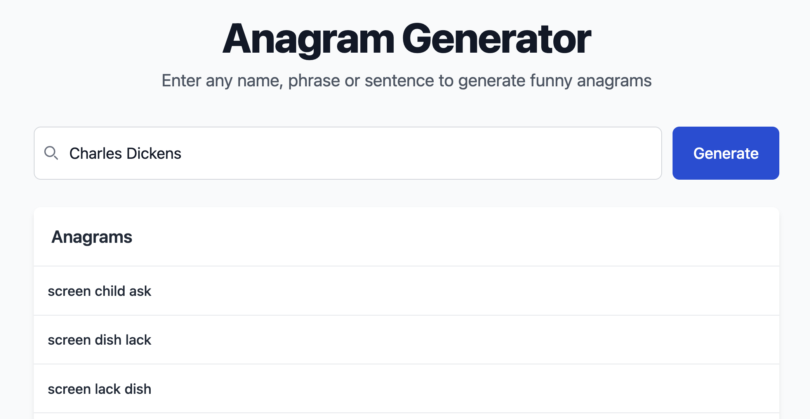

<br />
<div align="center">
  <a href="https://github.com/othneildrew/Best-README-Template">
    
  </a>

  <h3 align="center">Anagram generator</h3>

  <i align="center">
    "Henceforth, I shall be known as Chad Silkscreen" - Charles Dickens, 1856
  </i>
</div>

## About The Project

Inspired by Sonja Donut and other great anagrams, this tool generates anagrams of any word, phrase or sentence. It is mostly designed to work with first and last names, your mileage will vary for other use cases.

### Built With

[![Python][Python]][Python-url]
[![FastAPI][Fastapi]][Fastapi-url]
[](#)

<!-- GETTING STARTED -->

## Getting Started

### Prerequisites

This is an example of how to list things you need to use the software and how to install them.

- Python
- uv

### Run the project

```sh
uv run python server.py
```

## Usage

Simply enter a name in the input field and click the button to generate an anagram.

<div align="center">
  
</div>

## License

Distributed under the MIT License. See `LICENSE.txt` for more information.

## Contact

Quinten Bruynseraede

<!-- MARKDOWN LINKS & IMAGES -->

[Python]: https://img.shields.io/badge/python-3670A0?style=for-the-badge&logo=python&logoColor=ffdd54
[Python-url]: https://nextjs.org/
[Fastapi]: https://img.shields.io/badge/FastAPI-005571?style=for-the-badge&logo=fastapi
[Fastapi-url]: https://fastapi.tiangolo.com/
